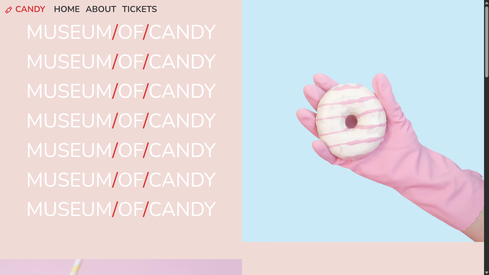
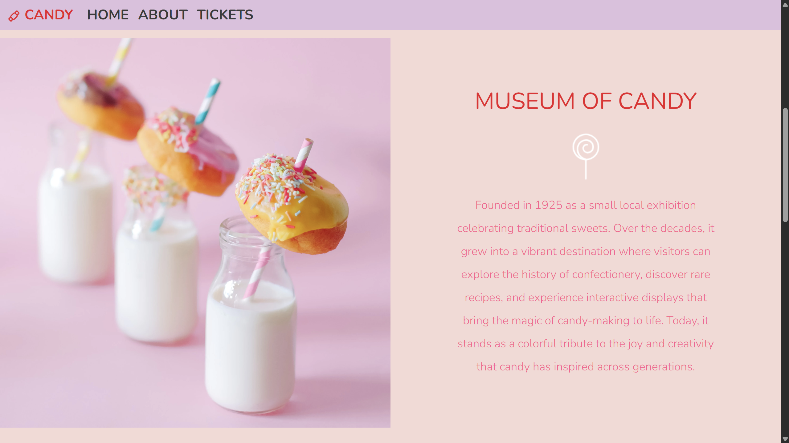
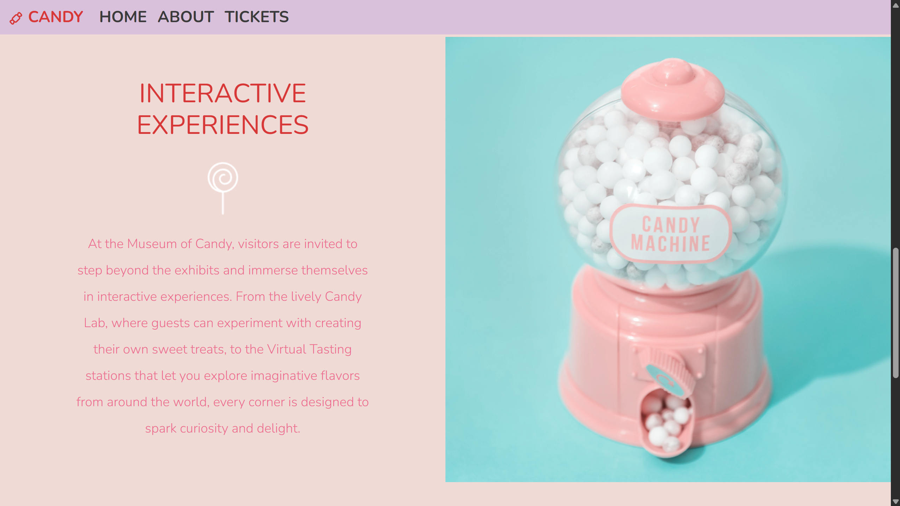
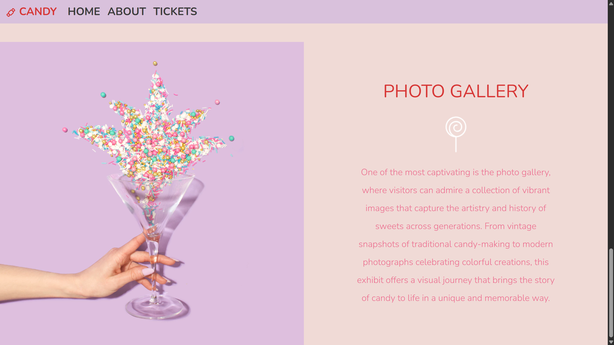

# 🍭 Museum Of Candy

Small fictional website about a candy museum, which is a project to learn about and understand the CSS library called Bootstrap in its version 5.3.

---

## 📸 Preview






---

## 🌐 Live Demo

🔗 [Watch Live Demo](https://museumofcandynic.netlify.app/)</br>
🧑‍💻 [Codepen](https://codepen.io/Oscar-Arias-G-/pen/ByKbQwR)

---

## 📄 Project Overview

Users should be able to:

- View the optimal layout depending on their device's screen size
- See hover states for interactive elements

---

## 🛠️ Tech Stack

- 
- 
- 
- 

---

## 📁 Project Structure

```bash
📦 museum-of-candy
├── 📁 css/
├── 📁 images/
├── 🙅🏻‍♂️ .gitignore
├── 📄 index.html
├── 🪪 LICENSE
├── 📖 README.md
```

---

## 📌 Features

- ✅ Semantic HTML5 Markup
- ✅ CSS Custom Properties
- ✅ Mobile-First Workflow
- ✅ Responsive Interface
- ✅ Bootstrap Grid System
- ✅ Compatibility With Multiple Browsers
- ✅ Modern And Professional Design

---

## ⚙️ Installation

```bash
git clone https://github.com/Oscar-Arias2001/museum-of-candy.git
cd museum-of-candy
```

Open `index.html` in your browser.

---

## 🤝 Contributions

Contributions are welcome. Please open an `issue` or make a `pull request`.

---

## 🧑‍💻 Author

**Oscar Arias**  
🐙 [GitHub](https://github.com/Oscar-Arias2001) </br>
🔗 [LinkedIn](https://www.linkedin.com/in/arias-oscar-8909b025b) </br>
🧸 [Codepen](https://codepen.io/Oscar-Arias-G-)

---

## 📄 License

This project is licensed under [MIT](LICENSE) license.
